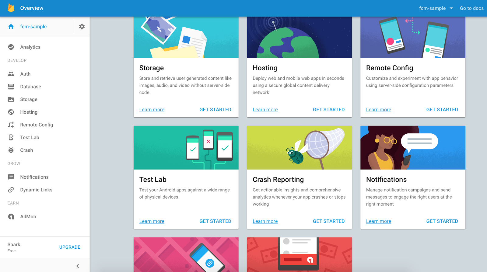
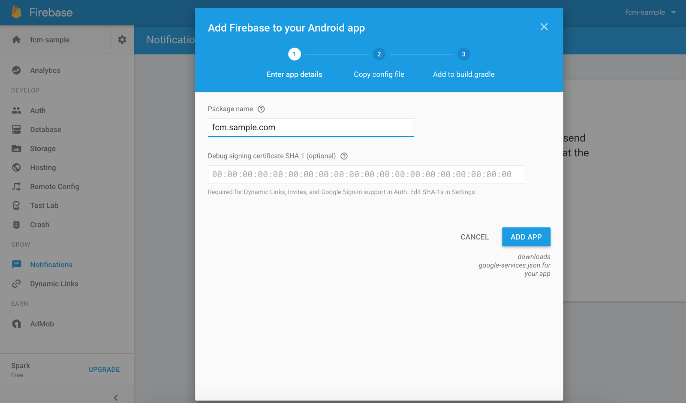

# Jubi.AI Android ChatBot
Android Plugin to implement chatbot

# What's in the box

- point 1
- point 2
- point 3
- point 4
- point 5

# Setup
## 1. Include in your project

### Using Gradle
The **Auth UI** library is pushed to jcenter, so you need to add the following dependency to your app's `build.gradle`.

```gradle
compile 'com.sayagodshala:jubiai-chatbot:1.0.0'
```

### As a module
If you can't include it as gradle dependency, you can also download this GitHub repo and copy the auth-ui folder to your project.


## 2. Usage

Next step is to configure the `AuthUISettings`.

Example:

```java
private ChatBotConfig chatBotConfig() {
    ChatBotConfig chatBotConfig = new ChatBotConfig();
    chatBotConfig.setAppLogo(R.drawable.ic_launcher);
    chatBotConfig.setMaterialTheme(MaterialTheme.BLUE);
    chatBotConfig.setTitle("YOUR PROJECT TITLE");
    chatBotConfig.setProjectId("YOUR PROJECT ID");
    chatBotConfig.setHost("https://somedomain.com");
    //        attachment by default is true
    //        chatBotConfig.setAttachmentRequired(false);
    //        speech by default is false
    //        chatBotConfig.setSpeechRequired(true);
    chatBotConfig.setFcmToken(FirebaseInstanceId.getInstance().getToken());
}
```
Next step is to save ChatBotConfig.

```java
@Override
protected void onCreate(Bundle savedInstanceState) {
    ...
    ChatBotActivity.saveConfig(this, chatBotConfig());
}
```

Next step is to check and give access to Overlay Permissions for displaying Widget.

```java

@Override
protected void onCreate(Bundle savedInstanceState) {
    ...
    ChatBotActivity.checkOverlayPermsForWidget(this);
}
```

Final step is to implement `ChatBotFragmentListener` interface in your target activity where `ChatBotFragment` is loaded with corresponding methods.

```java
public class ChatActivity extends AppCompatActivity implements ChatBotFragmentListener {


}
```

## 3. Set Up Android FCM

FCM push notifications setup

Below, we’ll show you how to send push notifications and/or push messages to your customers, with Firebase Cloud Messaging (FCM) in Jubi.AI.

### Step 1. Enable Google services for your app

If you already have a Firebase project with notifications enabled you can skip to the next step. Otherwise go to the [FCM Console page](https://console.firebase.google.com/?pli=1) and create a new project following these steps:

Give the project a name and click **Create Project**.


Once your project is set up, scroll down and select ‘Get started’ on the ‘Notifications’ card.



Enter your app’s package name and click ‘Add App’.



### Step 2. Setup client to receive push

Your google-services.json should automatically download. You’ll need to move that into the same directory as your application level build.gradle


In your apps build.gradle you will need to add the following lines to your dependencies:

```
dependencies {
    compile 'com.google.firebase:firebase-messaging:11.+'
}
```

At the bottom of your build.gradle you must add:

```
apply plugin: 'com.google.gms.google-services'
```

It is important that this is at the very end of the file.

### Step 3. Add your Server key to Jubi.AI for Android settings

Finally, click the settings cog and select ‘Project settings’, then ‘Cloud Messaging’ and copy your Server key.


Open your Jubi.AI app’s settings and select ‘Jubi.AI for Android’. Then find the ‘Enable Google Cloud Messaging’ section. Here you'll be able to paste and save your Server API key.

### Step 4. Setting your FCM icon

>Notifications icon design guidelines
We recommend following these [material design guidelines](https://material.google.com/patterns/notifications.html) for producing this icon.

### Step 5. Push FCM token to Jubi.AI

After you've obtained the token, you can send it to your app server and store it using your preferred method. For Example.

```java
public class MyFirebaseInstanceIDService extends FirebaseInstanceIdService {

    ...

    @Override
    public void onTokenRefresh() {
        // Get updated InstanceID token.
        String refreshedToken = FirebaseInstanceId.getInstance().getToken();
        Log.d(TAG, "Refreshed token: " + refreshedToken);

        // If you want to send messages to this application instance or
        // manage this apps subscriptions on the server side, send the
        // Instance ID token to your app server.
        sendRegistrationToServer(refreshedToken);
    }
    // [END refresh_token]

    ...
    private void sendRegistrationTokenToServer(String token) {
        // TODO: Implement this method to send token to your app server.
        ChatBotApp.pushFCMToken(this, token);
    }
```


